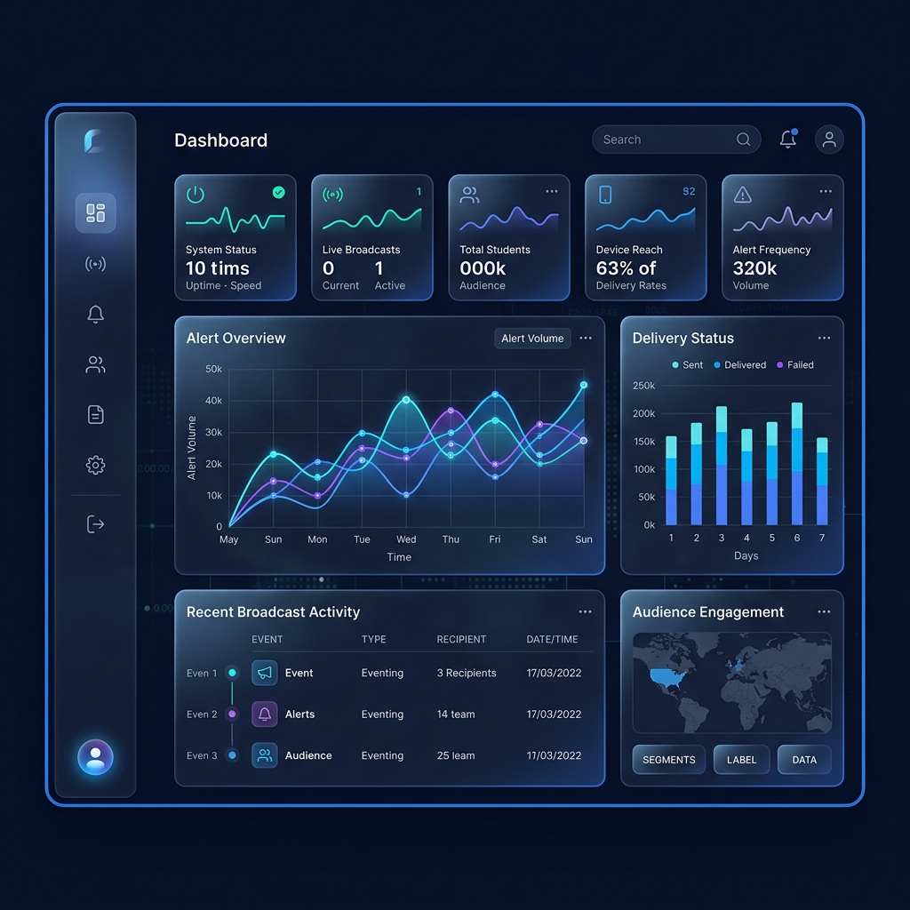

#  Advanced Campus Notifications Microservice



A high-performance, enterprise-grade notification system built with **Next.js 16**, **Material UI 6**, and **Framer Motion**. This microservice transforms standard alert management into a sophisticated executive dashboard with intelligent priority ranking and real-time analytics.

##  Premium Features

###  Executive Dashboard
- **Real-time Analytics**: Visualized notification distribution and volume trends using Recharts.
- **Dynamic Stat Cards**: Animated counters for total, placement, result, and event notifications.
- **Recent Activity Feed**: Instant visibility into the latest updates with intelligent relative timestamps.

### Intelligent Priority Inbox
- **Top-N Ranking Algorithm**: Sophisticated sorting based on weighted type scores, recency, and keyword urgency.
- **Interactive Control**: Real-time N-slider allows users to instantly filter the top 5 to 50 most critical alerts.
- **Ranking Badges**: Visual indicators (Trophy, Medal, Star) for the most urgent notifications.

###  State-of-the-Art Design
- **Glassmorphism UI**: Custom Material UI theme with frosted glass effects and deep navy aesthetics.
- **Dark/Light Mode**: Seamless, persistent theme transitions with zero layout shift.
- **Mobile-First Experience**: Fully responsive navigation with a specialized mobile bottom bar and touch-optimized interfaces.

###  Enterprise Engineering
- **API Resilience**: Intelligent mock fallback system ensures the UI remains functional and populated even during backend downtime.
- **Standardized Logging**: Custom `Log()` middleware integration across the entire stack for audit-ready traceability.
- **Refined State Management**: Global Context API architecture for real-time data synchronization and unread tracking.

##  Technology Stack

- **Framework**: Next.js 16 (App Router)
- **UI System**: Material UI 6 + Vanilla CSS
- **Animations**: Framer Motion
- **Visualization**: Recharts
- **Icons**: Lucide React
- **Logging**: Specialized Microservice Middleware

## Getting Started

1. **Install Dependencies**:
   ```bash
   cd notification_app_fe
   npm install
   ```

2. **Environment Configuration**:
   Create a `.env.local` file with the required API tokens and URLs.

3. **Run Development Server**:
   ```bash
   npm run dev
   ```

4. **Access the App**:
   Navigate to `http://localhost:3000` (or `3001` if port is occupied).

##  Design Standards
This project adheres to strict enterprise coding standards:
- Zero `console.log` usage (Log middleware only).
- Pure Material UI styling (No Tailwind/ShadCN).
- Responsive, accessible, and high-performance execution.

---
*Built for excellence in Campus Communication.*
